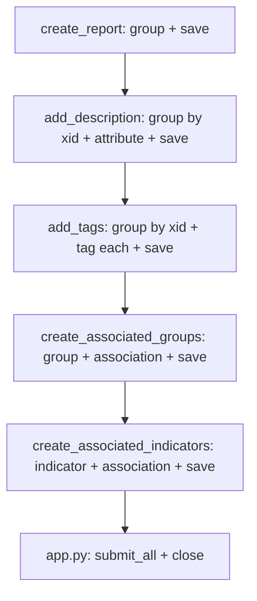

# Complete ThreatConnect Batch Helpers

## Current state

| File | Status |
|------|--------|
| [`helpers/doc_analysis.py`](report-analysis/helpers/doc_analysis.py) | Done (CAL integration) |
| [`helpers/tc_create_report.py`](report-analysis/helpers/tc_create_report.py) | XID only; no `batch.group` / `save` |
| [`helpers/enrich/*.py`](report-analysis/helpers/enrich/) | All `# TODO` stubs |
| [`app.py`](report-analysis/app.py) | Missing `batch.submit_all()` / `batch.close()` |

Reference: [`otx-pb/app.py`](../otx-pb/app.py) `_batch_create_groups` (lines 349–374) and `_batch_create_indicators` (lines 376–383).

## Batch strategy



- **One `submit_all()`** at end of `app.run()` (not per helper)
- **Idempotent XIDs** via `batch.generate_xid([owner, type, name])` for Report and associated groups
- **Indicators** — create by `type` + `summary` only (otx-pb pattern; no indicator XID unless needed later)
- **Create/update** — no separate lookup; deterministic XID + batch submit handles upsert

## 1. Optional shared utility (minimal DRY)

Add [`helpers/batch_report.py`](report-analysis/helpers/batch_report.py) with one helper:

```python
def report_group_batch(batch, report):
    return batch.group('Report', report.name, xid=report.xid)
```

Used by `add_description` and `add_tags` to avoid duplicating `batch.group('Report', ...)`.

## 2. Complete [`helpers/tc_create_report.py`](report-analysis/helpers/tc_create_report.py)

```python
xid = batch.generate_xid([owner_name, 'Report', report_name])
group_batch = batch.group('Report', report_name, xid=xid)
batch.save(group_batch)
return Report(owner_name=owner_name, name=report_name, xid=xid)
```

## 3. Complete enrich helpers

### [`helpers/enrich/add_description.py`](report-analysis/helpers/enrich/add_description.py)

```python
group_batch = report_group_batch(batch, report)
group_batch.attribute('Description', analysis.description, displayed=True, unique='Type')
batch.save(group_batch)
```

`unique='Type'` ensures one Description attribute per report (TcEx `Group.attribute` behavior).

### [`helpers/enrich/add_tags.py`](report-analysis/helpers/enrich/add_tags.py)

```python
group_batch = report_group_batch(batch, report)
for tag in analysis.tags:
    group_batch.tag(tag)
batch.save(group_batch)
```

### [`helpers/enrich/associated_groups.py`](report-analysis/helpers/enrich/associated_groups.py)

Per [`AssociatedGroup`](report-analysis/models/report.py):

```python
for group in analysis.associated_groups:
    xid = batch.generate_xid([owner_name, group.type, group.name])
    group_batch = batch.group(group.type, group.name, xid=xid)
    group_batch.association(report.xid)
    batch.save(group_batch)
```

### [`helpers/enrich/associated_indicators.py`](report-analysis/helpers/enrich/associated_indicators.py)

Per [`AssociatedIndicator`](report-analysis/models/report.py):

```python
for indicator in analysis.associated_indicators:
    indicator_batch = batch.indicator(indicator.type, indicator.summary)
    indicator_batch.association(report.xid)
    batch.save(indicator_batch)
```

No changes to [`helpers/enrich_report.py`](report-analysis/helpers/enrich_report.py) orchestrator.

## 4. Wire batch submit in [`app.py`](report-analysis/app.py)

After `enrich_report(...)`:

```python
batch_response = self.batch.submit_all()
self.batch.close()

errors = []
for item in batch_response:
    errors.extend(item.get('errors', []))
if errors:
    self.tcex.exit.exit(ExitCode.FAILURE, f'Batch submission failed: {errors[0]}')
```

Mirror otx-pb error extraction (lines 461–469). Log success count at `info` level.

## 5. Tests (mocked `BatchWriter`, no live TC)

| File | Updates |
|------|---------|
| [`tests/test_tc_create_report.py`](report-analysis/tests/test_tc_create_report.py) | Assert `batch.group('Report', ...)` and `batch.save` called |
| `tests/test_add_description.py` (new) | Assert `attribute('Description', ...)` + `save` |
| `tests/test_add_tags.py` (new) | Assert `tag()` called per tag + `save` |
| `tests/test_associated_groups.py` (new) | Assert `group`, `association(report.xid)`, `save` |
| `tests/test_associated_indicators.py` (new) | Assert `indicator`, `association`, `save` |
| [`tests/test_enrich_report.py`](report-analysis/tests/test_enrich_report.py) | Keep orchestration tests; optional one integration test with real sub-helper calls + mock batch |

Mock pattern: chain `batch.group.return_value` / `batch.indicator.return_value` as `MagicMock` with `.attribute`, `.tag`, `.association` methods.

## Files summary

| Action | Path |
|--------|------|
| Add | `helpers/batch_report.py` (optional, ~10 lines) |
| Update | `helpers/tc_create_report.py`, `helpers/enrich/*.py` (4 files), `app.py` |
| Add/Update | 4–5 test files |

## Out of scope

- Playbook output variables (`report.xid`, counts)
- Indicator XIDs for deduplication
- `batch.close()` in `teardown()` vs inline in `run()` (inline is fine for playbook apps)
- V3 REST API alternative
