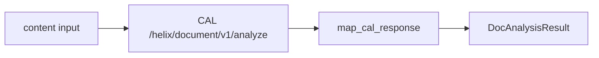

# Complete Doc Analysis Helper (CAL Integration)

## Approach

Call CAL directly from [`helpers/doc_analysis.py`](report-analysis/helpers/doc_analysis.py), mirroring the reference app in [`ignore/Clone of ThreatConnect Doc Analysis.abxz`](report-analysis/ignore/Clone%20of%20ThreatConnect%20Doc%20Analysis.abxz). Map `appData` into the existing [`DocAnalysisResult`](report-analysis/models/doc_analysis_result.py) — no JMESPath, no upstream JSON parsing.



**Minimal choices:**
- **Hardcode CAL apps** (no `features` input) — maps to reference app feature labels:

| Feature label | CAL app key |
|---------------|-------------|
| Alias Extraction | `alias` |
| IOC Extraction | `ioc` |
| AI Summary Generation | `textsummarize` |
| AI MITRE ATT&CK Classification | `attack` |
| AI NAICS Industry Classification | `textindustry` |

  Constant in `cal_client.py`: `CAL_APPS = 'alias,ioc,textsummarize,attack,textindustry'`
- Enable `CALSettings` feature so TC injects `tc_cal_host`, `tc_cal_token`, `tc_cal_timestamp` — no new user-facing params
- Truncate content to 100,000 chars (reference app behavior)
- Fail on CAL errors (raise; [`app.py`](report-analysis/app.py) already exits on `ValueError` — extend to HTTP errors)

## 1. Enable CALSettings

Update [`app_spec.yml`](report-analysis/app_spec.yml) and [`install.json`](report-analysis/install.json):

```yaml
features:
- CALSettings
- aotExecutionEnabled
# ...existing features
```

TcEx auto-adds [`CalSettingModel`](report-analysis/deps/tcex/input/model/cal_setting_model.py) fields at runtime when this feature is present. Update `content` input note to clarify it expects **plain text** for CAL (not JSON).

## 2. Split into two small helpers (keep doc_analysis thin)

### [`helpers/cal_client.py`](report-analysis/helpers/cal_client.py) (~40 lines)

Extract from reference `app.py`:

- `CALAuth` — `requests.auth.AuthBase` setting `Authorization` + `Timestamp` headers
- `CAL_APPS = 'alias,ioc,textsummarize,attack,textindustry'` (module constant)
- `analyze_document(session, content, cal_host, cal_token, cal_timestamp) -> list[dict]`
  - POST `{cal_host}/helix/document/v1/analyze`
  - Params: `source=playbooks`, `apps=CAL_APPS`, `output=clean`
  - Body: single document `{name, text, sourceId, shareable}`
  - Return `response[0]["appData"]`
  - Raise `ValueError` on 429; `requests.HTTPError` on other failures

### [`helpers/map_cal_response.py`](report-analysis/helpers/map_cal_response.py) (~80 lines, pure/testable)

```python
def map_cal_response(
    app_data: list[dict],
    *,
    resolve_mitre_tag: Callable[[str], str | None] | None = None,
) -> DocAnalysisResult:
```

Mapping rules (from reference `write_output` / `analyze_document`):

| DocAnalysisResult field | CAL source |
|-------------------------|------------|
| `description` | `app == "TextSummarizer"` → `summary` |
| `tags` | Attack pattern `objectId` via `resolve_mitre_tag`; NAICS industries from `app == "TextIndustrializer"` → `industry` (string or list); dedupe |
| `associated_groups` | `objectType` + `displayName`: `malware`→Malware, `intrusion set`→Intrusion Set, `tools`→Tool |
| `associated_indicators` | `indicatorType` + `uniqueId`: map CAL types to TC types (see below) |

**Indicator type map** (CAL key → TC type):

```python
INDICATOR_TYPE_MAP = {
    'address': 'Address', 'emailaddress': 'Email Address', 'host': 'Host',
    'url': 'URL', 'asn': 'ASN', 'cidr': 'CIDR', 'emailSubject': 'Email Subject',
    'hashtag': 'Hashtag', 'mutex': 'Mutex', 'registryKey': 'Registry Key',
    'userAgent': 'User Agent',
}
```

**File hashes** — reuse reference `categorize_hashes` logic: `indicatorType == "file"` → classify by length as File indicator (MD5/SHA1/SHA256 summary).

**MITRE tag resolver** — optional callback; in production wired to `tcex.api.tc.v3.mitre_tags.get_by_id`. Tests pass `None` or a stub lambda.

## 3. Update [`helpers/doc_analysis.py`](report-analysis/helpers/doc_analysis.py)

New signature (needs CAL creds + session):

```python
def doc_analysis(
    content: str,
    *,
    session,
    cal_host: str,
    cal_token: str,
    cal_timestamp: int,
    resolve_mitre_tag: Callable[[str], str | None] | None = None,
) -> DocAnalysisResult:
```

Orchestration only: validate content → truncate → `cal_client.analyze_document` → `map_cal_response`.

## 4. Wire [`app.py`](report-analysis/app.py)

In `run()`:

```python
with self.tcex.session.external as session:
    session.base_url = self.in_.tc_cal_host  # from CALSettings
    analysis = doc_analysis(
        content,
        session=session,
        cal_host=self.in_.tc_cal_host,
        cal_token=str(self.in_.tc_cal_token),
        cal_timestamp=self.in_.tc_cal_timestamp,
        resolve_mitre_tag=self.tcex.api.tc.v3.mitre_tags.get_by_id,
    )
```

Wrap `requests.RequestException` alongside existing `ValueError` handler.

## 5. Tests (no live CAL)

| File | What |
|------|------|
| [`tests/test_doc_analysis.py`](report-analysis/tests/test_doc_analysis.py) | Mock `analyze_document`; assert orchestration |
| `tests/test_map_cal_response.py` (new) | Fixture `app_data` JSON → assert description, groups, indicators, tags |
| `tests/fixtures/cal_app_data.json` (new) | Small synthetic `appData` sample |

Example fixture rows:

```json
[
  {"app": "TextSummarizer", "summary": "Threat report summary."},
  {"app": "TextIndustrializer", "industry": ["541512"]},
  {"indicatorType": "host", "uniqueId": "evil.example.com"},
  {"objectType": "malware", "displayName": "Emotet"},
  {"objectType": "attack pattern", "objectId": "T1059", "app": "AttackLabeler"}
]
```

## Files changed

| Action | Path |
|--------|------|
| Add | `helpers/cal_client.py`, `helpers/map_cal_response.py` |
| Update | `helpers/doc_analysis.py`, `app.py`, `app_spec.yml`, `install.json` |
| Add | `tests/test_map_cal_response.py`, `tests/fixtures/cal_app_data.json` |
| Update | `tests/test_doc_analysis.py` |

No changes to enrich steps, models, or `requirements.txt` (uses `requests` via tcex).

## Out of scope

- `features` / `additional_features` / `fail_on_error` inputs (CAL apps hardcoded as above)
- Zero-day features (`zeroday`, `zerodaysummary`)
- Playbook output variables for raw CAL JSON
