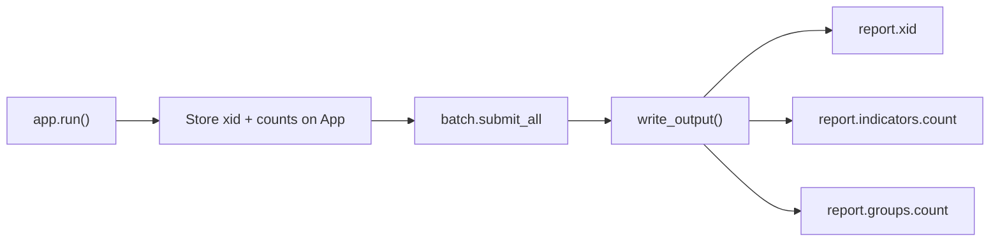

# Playbook Output Variables

## Goal

Expose downstream playbook variables after a successful run:

| Output | Type | Source |
|--------|------|--------|
| `report.xid` | String | `Report.xid` from [`create_report`](report-analysis/helpers/tc_create_report.py) |
| `report.indicators.count` | String | `len(analysis.associated_indicators)` from CAL mapping |
| `report.groups.count` | String | `len(analysis.associated_groups)` from CAL mapping |

Counts reflect **enrichment intent** (what Doc Analysis extracted), not batch API success rows — consistent with how the reference Doc Analysis app reports `.count` alongside parsed arrays.

## Approach



[`run.py`](report-analysis/run.py) always calls `write_output()` after `run()` on the success path; failed `tcex.exit.exit()` calls skip it — outputs only emit on success (desired).

## 1. Store output values on `App`

In [`app.py`](report-analysis/app.py), add instance fields (set defaults in `__init__` or as optional attributes):

```python
self.report_xid: str | None = None
self.indicators_count: int = 0
self.groups_count: int = 0
```

After `doc_analysis` and `create_report` in `run()`:

```python
self.report_xid = report.xid
self.indicators_count = len(analysis.associated_indicators)
self.groups_count = len(analysis.associated_groups)
```

Set these **before** `submit_all()` so they are available even if batch logging fails later (xid/counts are known pre-submit).

## 2. Implement `write_output()`

Follow [`csv_hosted/app.py`](../csv_hosted/app.py) and reference Doc Analysis `set_variable_with_count` pattern:

```python
def write_output(self):
    self.log.info('Writing Output')
    if self.report_xid is not None:
        self.playbook.create.string('report.xid', self.report_xid)
    self.playbook.create.string('report.indicators.count', self.indicators_count)
    self.playbook.create.string('report.groups.count', self.groups_count)
```

Use `playbook.create.string` for all three — reference Doc Analysis registers `.count` outputs as `String` in `install.json`; `create.string` coerces ints via TcEx.

(`self.out` is an alias for `self.playbook.create` per [`playbook_app.py`](report-analysis/playbook_app.py) — either works.)

## 3. Declare outputs in metadata

### [`app_spec.yml`](report-analysis/app_spec.yml)

Replace `outputData: []`:

```yaml
outputData:
- display: '1'
  outputVariables:
  - name: report.xid
  - name: report.indicators.count
  - name: report.groups.count
```

### [`install.json`](report-analysis/install.json)

Add under `playbook.outputVariables` (mirror [`csv_hosted/install.json`](../csv_hosted/install.json)):

```json
"playbook": {
  "outputVariables": [
    {"name": "report.xid", "type": "String"},
    {"name": "report.indicators.count", "type": "String"},
    {"name": "report.groups.count", "type": "String"}
  ],
  "type": "Utility"
}
```

Bump `programVersion` to `1.1.0` and add a release note entry in `app_spec.yml`.

## 4. Tests

Add `tests/test_write_output.py`:

- Instantiate `App` with mocked `tcex` / `playbook.create`
- Set `report_xid`, `indicators_count`, `groups_count` on the instance
- Call `write_output()`
- Assert `playbook.create.string` called with expected keys and values

No changes to helper modules or models required.

## Files changed

| Action | Path |
|--------|------|
| Update | [`app.py`](report-analysis/app.py) |
| Update | [`app_spec.yml`](report-analysis/app_spec.yml) |
| Update | [`install.json`](report-analysis/install.json) |
| Add | `tests/test_write_output.py` |

## Out of scope

- `report.name`, `report.id` (TC internal ID not available from batch XID alone)
- `tags.count`, `report.summary`, raw CAL JSON
- Writing outputs on partial failure / CAL-only success without batch submit
