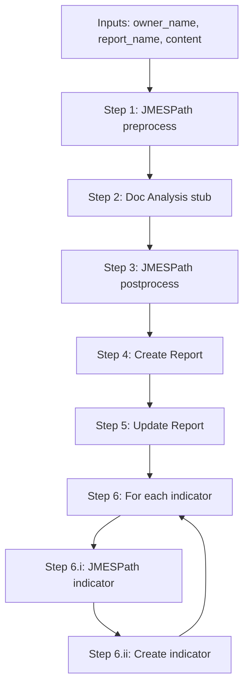

# Report Analysis Playbook App Skeleton

## Current state

[`report-analysis`](report-analysis/) is a fresh TcEx 4.0 basic template: empty [`app.py`](report-analysis/app.py), no inputs in [`app_spec.yml`](report-analysis/app_spec.yml), and no `helpers/` package yet. Sibling apps ([`qualys`](qualys/), [`json_xml_conversion`](json_xml_conversion/), [`otx-pb`](otx-pb/)) establish the conventions to follow:

- **Thin `app.py`** orchestrates steps; logic lives in `helpers/`
- **Inputs** declared in `app_spec.yml` + [`app_inputs.py`](report-analysis/app_inputs.py) (`AppPlaybookModel` fields)
- **TC API** via `self.tcex.api.tc` — [`otx-pb/app.py`](otx-pb/app.py) uses `self.tcex.api.tc.v2.batch(owner)` for Report groups and indicators

## Target pipeline



## 1. Declare inputs

Update [`app_inputs.py`](report-analysis/app_inputs.py) with three `String` fields (matching [`otx-pb/app_inputs.py`](otx-pb/app_inputs.py) style):

```python
from tcex.input.field_type import String

class AppBaseModel(AppPlaybookModel):
    owner_name: String
    report_name: String
    content: String
```

Mirror the same three params in [`app_spec.yml`](report-analysis/app_spec.yml) and [`install.json`](report-analysis/install.json):

| Param | Label | Type | Required |
|-------|-------|------|----------|
| `owner_name` | Owner Name | String (`${TEXT}`) | yes |
| `report_name` | Report Name | String (`${TEXT}`) | yes |
| `content` | content | String (`${TEXT}`) | yes |

Also update app metadata (`displayName`, `packageName`, `note`) from the basic template defaults to something like **Report Analysis**.

No playbook outputs in this skeleton (leave `outputData: []`); can add `report.id` / `report.xid` later.

## 2. Add dependency

Add explicit `jmespath` to [`requirements.txt`](report-analysis/requirements.txt) (it is already a transitive dep in sibling apps but should be declared since we use it directly):

```text
tcex>=4.0.0,<4.1.0
jmespath>=1.0.0
```

Run `tcex deps` after implementation to populate `deps/` for local runs.

## 3. Create `helpers/` package (one module per step)

```
helpers/
├── __init__.py
├── jmespath_preprocess.py      # Step 1
├── doc_analysis.py             # Step 2 (stub)
├── jmespath_postprocess.py     # Step 3
├── tc_create_report.py         # Step 4
├── tc_update_report.py         # Step 5
├── jmespath_indicator.py       # Step 6.i
└── tc_create_indicator.py      # Step 6.ii
```

Each module exports **one primary function** with a clear signature and docstring. Skeleton bodies return typed placeholders / raise `NotImplementedError` only where TC wiring is deferred — prefer returning stub dicts so `app.py` can be exercised end-to-end without a live TC instance.

### Shared patterns

- **JMESPath helpers** (steps 1, 3, 6.i): parse `content` if JSON string, then `jmespath.search(expression, data)`. Keep expressions as module-level constants (`JMESPATH_EXPRESSION = '...'  # TODO`) for now.
- **Doc Analysis** (step 2): stub per your choice — accept parsed data, log/trace, return input unchanged with a `# TODO` comment.
- **TC Report helpers** (steps 4–5): accept `tcex: TcEx`, `owner_name`, `report_name`, and shaped `report_data: dict`. Follow [`otx-pb`](otx-pb/app.py) batch pattern as the likely implementation path:
  - `create_report(...)` → build/save a `Report` group batch entry, return `{"xid": ..., "name": ...}`
  - `update_report(...)` → apply attributes/tags from `report_data` to the created report (stub returns merged dict)
- **Indicator helpers** (steps 6.i–6.ii): `jmespath_indicator(indicator_raw)` normalizes one indicator; `create_indicator(tcex, owner_name, indicator_data, report_xid)` associates to report (stub mirrors `_batch_create_indicators` in otx-pb).

Example signatures:

```python
# helpers/jmespath_preprocess.py
def jmespath_preprocess(content: str) -> dict: ...

# helpers/doc_analysis.py
def doc_analysis(data: dict) -> dict: ...  # pass-through stub

# helpers/tc_create_report.py
def create_report(tcex: TcEx, owner_name: str, report_name: str, report_data: dict) -> dict: ...
```

## 4. Orchestrate in `app.py`

Keep [`app.py`](report-analysis/app.py) thin, modeled on [`qualys/app.py`](qualys/app.py):

```python
class App(PlaybookApp):
    def __init__(self, _tcex: TcEx):
        super().__init__(_tcex)
        self.batch = self.tcex.api.tc.v2.batch(self.in_.owner_name)  # for steps 4–6

    def run(self):
        preprocessed = jmespath_preprocess(self.in_.content)
        analyzed = doc_analysis(preprocessed)
        report_payload = jmespath_postprocess(analyzed)
        report = create_report(self.tcex, self.in_.owner_name, self.in_.report_name, report_payload)
        update_report(self.tcex, self.in_.owner_name, report, report_payload)

        for indicator_raw in report_payload.get("indicators", []):
            indicator_data = jmespath_indicator(indicator_raw)
            create_indicator(self.tcex, self.in_.owner_name, indicator_data, report["xid"])

        self.exit_message = f'Report {self.in_.report_name} processed.'
```

- Use `self.in_unresolved.content` instead of `self.in_.content` if content may arrive as non-String playbook variable types (same pattern as [`json_xml_conversion/app.py`](json_xml_conversion/app.py)).
- Wrap `run()` in `try/except` with `self.tcex.exit.exit(ExitCode.FAILURE, ...)` for consistency with mature apps.
- `write_output()` stays a no-op stub for now.

## 5. Optional test stubs

Add minimal pytest files under `tests/` (configured in [`pyproject.toml`](report-analysis/pyproject.toml)) for the pure helpers only:

- `tests/test_jmespath_preprocess.py` — JSON in, dict out
- `tests/test_doc_analysis.py` — pass-through stub behavior

Skip TC API helper tests until real batch logic exists (would need mocking `TcEx`).

## Files changed (summary)

| File | Change |
|------|--------|
| [`app_inputs.py`](report-analysis/app_inputs.py) | Add 3 String inputs |
| [`app_spec.yml`](report-analysis/app_spec.yml) | Inputs + rename app metadata |
| [`install.json`](report-analysis/install.json) | Mirror `app_spec.yml` inputs/metadata |
| [`requirements.txt`](report-analysis/requirements.txt) | Add `jmespath` |
| [`app.py`](report-analysis/app.py) | Orchestrate pipeline |
| `helpers/*.py` (8 files) | One function per step |
| `tests/test_*.py` (optional) | Pure helper smoke tests |

**Leave unchanged:** [`run.py`](report-analysis/run.py), [`playbook_app.py`](report-analysis/playbook_app.py) — standard TcEx template files.

## Out of scope (future work)

- Real JMESPath expressions (currently `TODO` constants)
- Doc Analysis integration (stub only)
- Batch `submit_all()` / error handling (otx-pb submits per page; decide batching strategy when implementing)
- Playbook output variables (`report.id`, indicator counts, etc.)
- V3 REST API alternative to v2 batch (if batch proves insufficient for update semantics)
