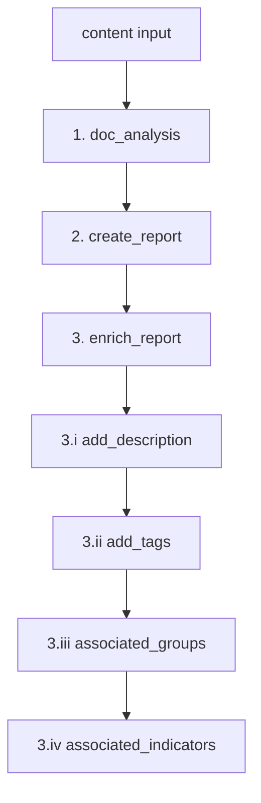

# Report-Centric Enrichment Refactor

## Goal

Replace the current JMESPath-heavy pipeline in [`app.py`](report-analysis/app.py) with a **Report object** workflow driven by Doc Analysis output:



## Current vs new

| Current | New |
|---------|-----|
| `jmespath_preprocess` → `doc_analysis(dict)` → `jmespath_postprocess` | `doc_analysis(content: str)` |
| `create_report` + `update_report` | `create_report` → `enrich_report` |
| indicator loop in `app.py` with `jmespath_indicator` | `enrich_associated_indicators` inside step 3 |
| dict payloads everywhere | typed `Report` + `DocAnalysisResult` models |

## 1. Add domain models

New package [`models/`](report-analysis/models/):

**[`models/report.py`](report-analysis/models/report.py)** — dataclasses (stdlib `dataclasses`, no new deps):

```python
@dataclass
class AssociatedGroup:
    type: str
    name: str

@dataclass
class AssociatedIndicator:
    type: str
    summary: str

@dataclass
class Report:
    owner_name: str
    name: str
    xid: str
    type: str = 'Report'
```

**[`models/doc_analysis_result.py`](report-analysis/models/doc_analysis_result.py)**:

```python
@dataclass
class DocAnalysisResult:
    description: str | None = None
    tags: list[str] = field(default_factory=list)
    associated_groups: list[AssociatedGroup] = field(default_factory=list)
    associated_indicators: list[AssociatedIndicator] = field(default_factory=list)
```

**[`models/__init__.py`](report-analysis/models/__init__.py)** — re-export public types.

## 2. Restructure helpers

### Step 1 — [`helpers/doc_analysis.py`](report-analysis/helpers/doc_analysis.py)

- Change signature: `doc_analysis(content: str) -> DocAnalysisResult`
- Stub: return empty `DocAnalysisResult()` with `# TODO` for real Doc Analysis integration
- Validate non-empty `content` (raise `ValueError` like current preprocess)

### Step 2 — [`helpers/tc_create_report.py`](report-analysis/helpers/tc_create_report.py)

- Change return type from `dict` to `Report`
- Keep `batch.generate_xid([owner_name, 'Report', report_name])` (already implemented)
- Stub: `# TODO batch.group('Report', report_name, xid=xid)` + `batch.save(...)`
- Drop unused `report_data` param (enrichment is separate now)

### Step 3 — new enrich package

```
helpers/enrich/
├── __init__.py
├── add_description.py       # 3.i
├── add_tags.py              # 3.ii
├── associated_groups.py     # 3.iii
└── associated_indicators.py # 3.iv
```

Each exports one function, skeleton pattern:

```python
def add_description(batch: BatchWriter, report: Report, analysis: DocAnalysisResult) -> None:
    if not analysis.description:
        return
    # TODO: batch group attribute on report xid
```

```python
def add_tags(batch, report, analysis) -> None:
    if not analysis.tags:
        return
    # TODO: batch.tag(...) per tag
```

```python
def create_associated_groups(batch, owner_name, report, analysis) -> None:
    if not analysis.associated_groups:
        return
    # TODO: mirror otx-pb _batch_create_groups + association to report.xid
```

```python
def create_associated_indicators(batch, owner_name, report, analysis) -> None:
    if not analysis.associated_indicators:
        return
    # TODO: mirror otx-pb _batch_create_indicators + association to report.xid
```

**[`helpers/enrich_report.py`](report-analysis/helpers/enrich_report.py)** — orchestrator for step 3:

```python
def enrich_report(batch, owner_name, report, analysis) -> Report:
    add_description(batch, report, analysis)
    add_tags(batch, report, analysis)
    create_associated_groups(batch, owner_name, report, analysis)
    create_associated_indicators(batch, owner_name, report, analysis)
    return report
```

Reference implementation patterns from [`otx-pb/app.py`](../otx-pb/app.py) (`_batch_create_groups`, `_batch_create_indicators`, lines 349–383).

## 3. Simplify [`app.py`](report-analysis/app.py)

```python
content = cast('str', self.in_unresolved.content)
analysis = doc_analysis(content)
report = create_report(self.batch, self.in_.owner_name, self.in_.report_name)
enrich_report(self.batch, self.in_.owner_name, report, analysis)
# TODO: batch.submit_all() + error handling
```

Remove all JMESPath and `update_report` / indicator-loop imports.

## 4. Delete obsolete files

Remove entirely (per your choice):

- [`helpers/jmespath_preprocess.py`](report-analysis/helpers/jmespath_preprocess.py)
- [`helpers/jmespath_postprocess.py`](report-analysis/helpers/jmespath_postprocess.py)
- [`helpers/jmespath_indicator.py`](report-analysis/helpers/jmespath_indicator.py)
- [`helpers/tc_update_report.py`](report-analysis/helpers/tc_update_report.py)
- [`helpers/tc_create_indicator.py`](report-analysis/helpers/tc_create_indicator.py)
- [`tests/test_jmespath_preprocess.py`](report-analysis/tests/test_jmespath_preprocess.py)

## 5. Dependencies

- Remove `jmespath>=1.0.0` from [`requirements.txt`](report-analysis/requirements.txt) (still available transitively via `tcex`)
- Re-run `tcex deps` to refresh `deps/` and `requirements.lock`

## 6. Update tests

| File | Action |
|------|--------|
| [`tests/test_doc_analysis.py`](report-analysis/tests/test_doc_analysis.py) | Assert `doc_analysis('...')` returns `DocAnalysisResult` |
| [`tests/test_tc_create_report.py`](report-analysis/tests/test_tc_create_report.py) | Assert return type is `Report` with generated `xid` |
| `tests/test_enrich_report.py` (new) | Smoke test: empty analysis is no-op; stub with tags/groups calls sub-helpers |
| `tests/test_jmespath_preprocess.py` | Delete |

## Files summary

| Action | Path |
|--------|------|
| Add | `models/report.py`, `models/doc_analysis_result.py`, `models/__init__.py` |
| Add | `helpers/enrich/*.py`, `helpers/enrich_report.py` |
| Update | `helpers/doc_analysis.py`, `helpers/tc_create_report.py`, `app.py`, `requirements.txt`, tests |
| Delete | 5 obsolete helper files + jmespath test |

## Out of scope (future)

- Real Doc Analysis API integration
- `batch.submit_all()` / `batch.close()` error handling
- Create-vs-update logic for existing groups/indicators by XID
- Playbook output variables (`report.xid`, counts, etc.)
