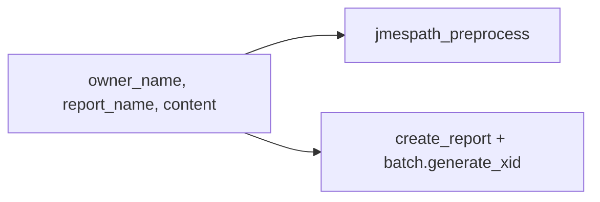

# Report XID via batch.generate_xid

## Recommendation: skip JMESPath for XID

Your expression `[owner_name,type,name] | join(':',[]) | uuid5(@)` is a Playbook JMESPath pattern. In this Python app it does **not** belong in [`helpers/jmespath_preprocess.py`](helpers/jmespath_preprocess.py) because:

- **Preprocess runs on `content` JSON only** — `owner_name` and `report_name` are separate playbook inputs ([`app_inputs.py`](app_inputs.py)), not fields inside `content`.
- **Python `jmespath` has no `uuid5()`** — would require custom function registration for no real benefit.
- **You chose TcEx `batch.generate_xid`** — same approach as [`otx-pb/app.py`](../otx-pb/app.py); internally joins identifiers and hashes them (reproducible, owner-scoped).

```python
# otx-pb pattern (line ~355)
xid = self.batch.generate_xid([self.in_.owner, group['type'], group['name']])
```

For this app:

```python
xid = batch.generate_xid([owner_name, 'Report', report_name])
```

## Changes

### 1. Update [`helpers/tc_create_report.py`](helpers/tc_create_report.py)

- Add a `batch` parameter (type: TcEx batch writer instance).
- Replace stub `'stub-report-xid'` with:

```python
xid = batch.generate_xid([owner_name, 'Report', report_name])
return {'xid': xid, 'name': report_name, 'type': 'Report'}
```

- Keep the rest of batch group creation as `# TODO` for now (skeleton scope).

### 2. Update [`app.py`](app.py)

Pass `self.batch` into `create_report`:

```python
report = create_report(
    self.batch,
    self.in_.owner_name,
    self.in_.report_name,
    report_payload,
)
```

Remove `tcex` from `create_report` signature if no longer needed there (or keep if other TC calls are planned soon).

### 3. Optional: small test

Add `tests/test_tc_create_report.py` with a mocked batch object whose `generate_xid` returns a fixed string — verifies wiring without a live TC instance.

## What stays unchanged

- [`helpers/jmespath_preprocess.py`](helpers/jmespath_preprocess.py) — still parses/transforms `content` JSON only; no XID logic.
- Indicator XIDs — not in scope; can use `batch.generate_xid([owner_name, type, summary])` later in [`helpers/tc_create_indicator.py`](helpers/tc_create_indicator.py) when real batch logic is added.

## Data flow (unchanged except step 4)


